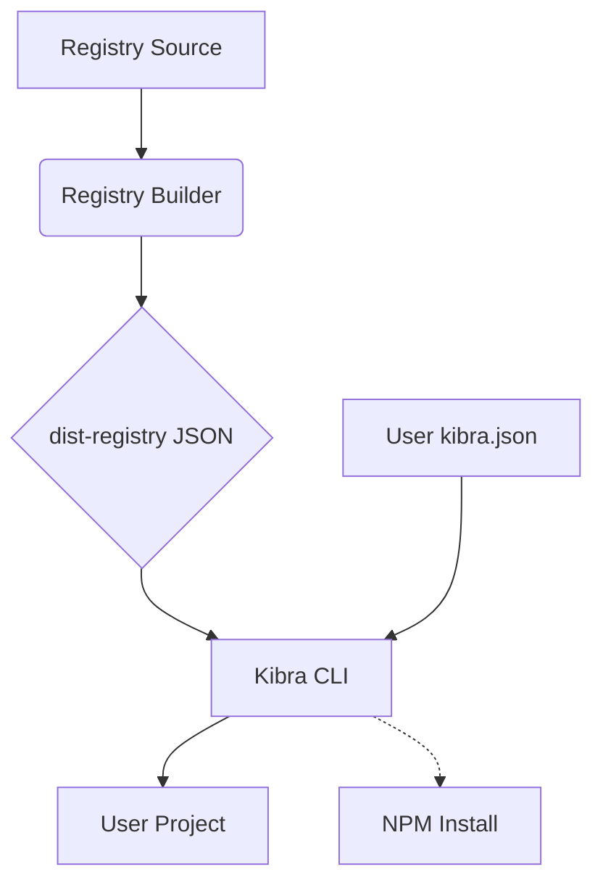

# 🧠 Architecture & Philosophy

Why did we build Kibra? And more importantly, how does it handle your code with such precision?

## The "Blueprint" Philosophy
Unlike traditional component libraries that ship compiled code in `node_modules`, Kibra ships **Blueprints**. 

When you run `add`, you are not installing a package; you are "forking" a source file into your own codebase. This gives you 100% control over the styling, props, and behavior of your UI.

---

## Technical Core

### 1. AST-Powered Dependency Detection
Kibra doesn't use fragile Regex to find dependencies. We use the **TypeScript Compiler API** to parse your source code into an Abstract Syntax Tree (AST). 
- We detect every `import` statement.
- We distinguish between "External" (NPM) and "Registry" (Local) dependencies.
- We auto-generate the `registry.json` metadata so you don't have to maintain it manually.

### 2. Template Interpolation Engine
When a component is "teleported" from our registry to your project, it goes through our interpolation engine:
- **Alias Mapping**: If your project uses `@ui/` instead of `@/components/ui`, Kibra detects this and rewrites the imports on the fly.
- **Token Replacement**: We use `{{UTILS_ALIAS}}` and `{{COMPONENTS_ALIAS}}` tokens in our source files to ensure perfect fitment regardless of your folder structure.

### 3. Atomic Writes with Transactional Safety
To avoid corrupting your project during a crash, Kibra uses an **Atomic Write Pattern**:
1. Files are written to a `.kibra-tmp-*` file first.
2. Only after a successful write is the file renamed to its final target.
3. If an error occurs, the temporary files are automatically cleaned up.

---

## Data Flow

### Registry Integrity
Every push to the Kibra main branch triggers a CI workflow that rebuilds the entire JSON registry, ensuring that the components you see in the Showroom are always perfectly synced with the code in the repo.

---

## Design Choices
- **Zero-Dependency Runtime**: Once a component is in your project, it has no connection back to Kibra. You own the code.
- **A11y First**: Every component in the Kibra registry must pass an accessibility audit before being merged.
- **NativeWind Optimized**: Our engine is specifically tuned for Tailwind CSS in React Native.
